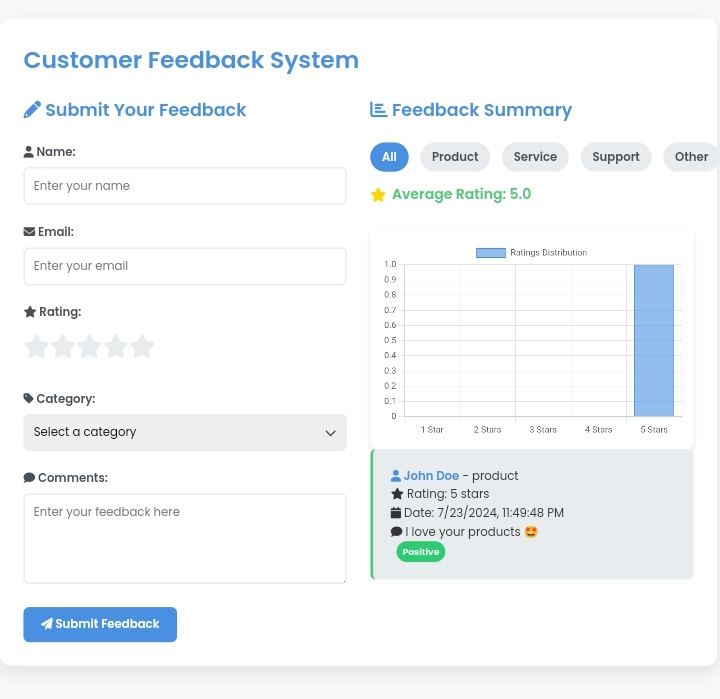

# Customer Feedback System

## Description

A simple Customer Feedback System built with React. It allows users to submit feedback, view feedback summaries, and analyze sentiment. The system includes features such as rating distribution charts, sentiment analysis, and category filtering.



## Features

- User-friendly feedback submission form
- Real-time form validation
- Star rating system
- Category selection
- Sentiment analysis of feedback comments
- Interactive chart displaying rating distribution
- Filtering of feedback by category
- Local storage for persisting feedback data
- Responsive design for various screen sizes

## Technologies Used

- React
- Chart.js for data visualization
- Local Storage API for data persistence
- FontAwesome for icons

## Installation

1. Clone the repository:
   ```
   git clone https://github.com/JohnDev19/customer-feedback-system.git
   ```
2. Navigate to the project directory:
   ```
   cd customer-feedback-system
   ```
3. Open `index.html` in a web browser.

## Usage

1. Fill out the feedback form with your name, email, rating, category, and comments.
2. Submit the form to add your feedback to the system.
3. View the feedback summary, including the average rating and rating distribution chart.
4. Use the category filters to view feedback for specific categories.
5. Observe the sentiment analysis for each feedback item.

## Contributing

Contributions to improve the Advanced Customer Feedback System are welcome. Please follow these steps to contribute:

1. Fork the repository
2. Create a new branch (`git checkout -b feature/AmazingFeature`)
3. Commit your changes (`git commit -m 'Add some AmazingFeature'`)
4. Push to the branch (`git push origin feature/AmazingFeature`)
5. Open a Pull Request

## License

Distributed under the MIT License. See `LICENSE` for more information.

## Acknowledgements

- [React](https://reactjs.org/)
- [Chart.js](https://www.chartjs.org/)
- [FontAwesome](https://fontawesome.com/)
